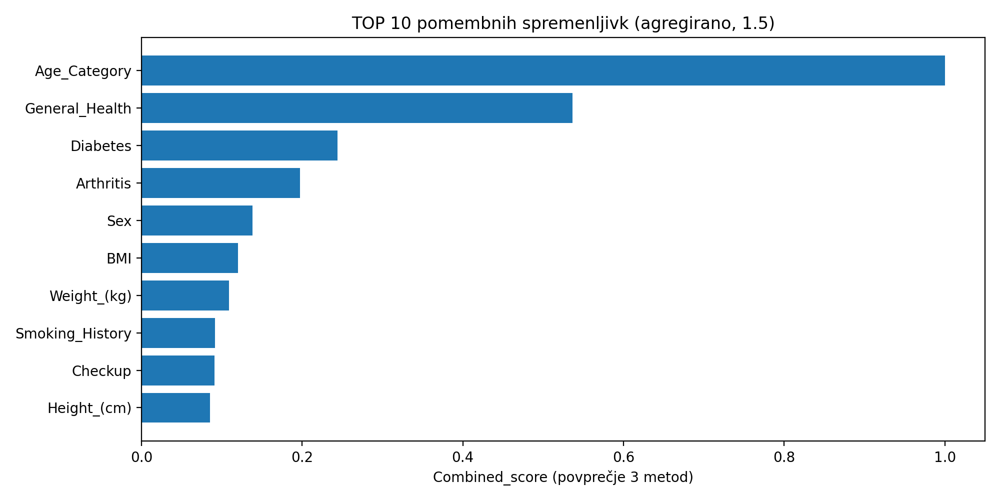
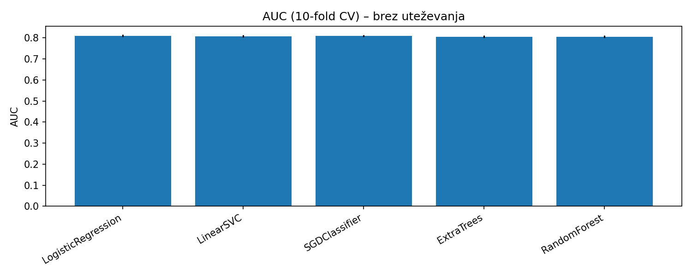
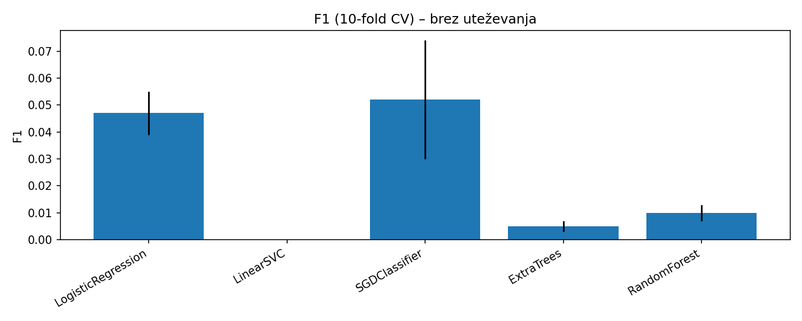
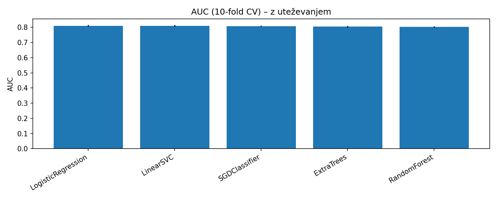
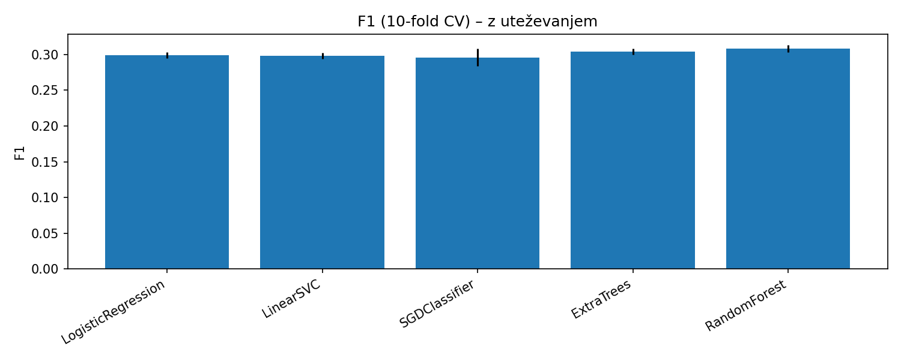

# Seminarska naloga – Celovita podatkovna analiza in optimizacija procesa 
---
## 1.1 Izbor podatkov
- Izbrana *javno dostopna* baza podatkov
- Za seminarsko nalogo sva izbrala javno dostopno bazo podatkov iz Kaggle:
- Ime podatkovne baze: *Cardiovascular Diseases Risk Prediction Dataset*
- Velikost podatkov: 308,854 zapisov × 19 spremenljivk
- Vsebina: anketni (samoporočani) podatki o zdravju in življenjskem slogu odraslih, z indikatorjem prisotnosti srčne bolezni.

### Namen analize
- Namen analize je razumeti povezave med dejavniki življenjskega sloga/zdravja in srčno-žilnimi tveganji ter pripraviti podatkovno osnovo za gradnjo napovednih modelov in kasnejšo simulacijo optimizacijskih ukrepov.

### Opis spremenljivk (ime, pomen, tip)

| Spremenljivka                    | Prevod                              | Pomen / opis                                                       | Tip spremenljivke        | Možne vrednosti / merilo                                                                                     |
| -------------------------------- | ----------------------------------- | ------------------------------------------------------------------ | ------------------------ | ------------------------------------------------------------------------------------------------------------ |
| **General_Health**               | **Splošno zdravje**                 | Samoocena splošnega zdravstvenega stanja.                          | kategorialna (ordinalna) | `Poor`, `Fair`, `Good`, `Very Good`, `Excellent`                                                             |
| **Checkup**                      | **Zadnji preventivni pregled**      | Kdaj je bil zadnji rutinski zdravstveni pregled.                   | kategorialna (ordinalna) | `Within the past year`, `Within the past 2 years`, `Within the past 5 years`, `5 or more years ago`, `Never` |
| **Exercise**                     | **Telesna aktivnost**               | Ali je oseba izvajala telesno aktivnost.                           | kategorialna (binarna)   | `Yes` / `No`                                                                                                 |
| **Heart_Disease**                | **Srčna bolezen**                   | Prisotnost srčne bolezni (ciljna spremenljivka za klasifikacijo).  | kategorialna (binarna)   | `Yes` / `No`                                                                                                 |
| **Skin_Cancer**                  | **Kožni rak**                       | Prisotnost/zgodovina kožnega raka.                                 | kategorialna (binarna)   | `Yes` / `No`                                                                                                 |
| **Other_Cancer**                 | **Drugi rak**                       | Prisotnost/zgodovina druge vrste raka.                             | kategorialna (binarna)   | `Yes` / `No`                                                                                                 |
| **Depression**                   | **Depresija**                       | Prisotnost/diagnoza depresije.                                     | kategorialna (binarna)   | `Yes` / `No`                                                                                                 |
| **Diabetes**                     | **Diabetes (sladkorna bolezen)**    | Status diabetesa.                                                  | kategorialna (nominalna) | `No`, `Yes`, `No, pre-diabetes or borderline diabetes`, `Yes, but female told only during pregnancy`         |
| **Arthritis**                    | **Artritis**                        | Prisotnost artritisa.                                              | kategorialna (binarna)   | `Yes` / `No`                                                                                                 |
| **Sex**                          | **Spol**                            | Spol anketiranca.                                                  | kategorialna (nominalna) | `Female` / `Male`                                                                                            |
| **Age_Category**                 | **Starostna skupina**               | Starost v kategorijah.                                             | kategorialna (ordinalna) | `18-24`, `25-29`, …, `75-79`, `80+` (skupaj 13 kategorij)                                                    |
| **Height_(cm)**                  | **Višina (cm)**                     | Višina osebe v centimetrih.                                        | numerična (kontinuirna)  | realne vrednosti; v naboru približno **91–241 cm**                                                           |
| **Weight_(kg)**                  | **Teža (kg)**                       | Teža osebe v kilogramih.                                           | numerična (kontinuirna)  | realne vrednosti; v naboru približno **24.95–293.02 kg**                                                     |
| **BMI**                          | **ITM / BMI (indeks telesne mase)** | Indeks telesne mase (kg/m²).                                       | numerična (kontinuirna)  | realne vrednosti; v naboru približno **12.02–99.33**                                                         |
| **Smoking_History**              | **Kadilska zgodovina**              | Ali je oseba kadila/kadi (zgodovina kajenja).                      | kategorialna (binarna)   | `Yes` / `No`                                                                                                 |
| **Alcohol_Consumption**          | **Uživanje alkohola**               | Pogostost/mera uživanja alkohola (številčno kodirano).             | numerična (diskretna)    | vrednosti **0–30**                                                                                           |
| **Fruit_Consumption**            | **Uživanje sadja**                  | Pogostost uživanja sadja (številčno kodirano).                     | numerična (diskretna)    | vrednosti **0–120**                                                                                          |
| **Green_Vegetables_Consumption** | **Uživanje zelene zelenjave**       | Pogostost uživanja zelene zelenjave (številčno kodirano).          | numerična (diskretna)    | vrednosti **0–128**                                                                                          |
| **FriedPotato_Consumption**      | **Uživanje ocvrtega krompirja**     | Pogostost uživanja ocvrtih krompirjevih jedi (številčno kodirano). | numerična (diskretna)    | vrednosti **0–128**                                                                                          |
---
## 1.2 Pregled in čiščenje podatkov

Čeprav v opisu podatkovne baze piše da je očiščena, sva se odločila da podatke tudi midva preveriva. 
Vse korake, izpise in preveritve sva dokumentirala v Python zvezku: `1_2_pregled_in_ciscenje.ipynb`.

### Preverjanje manjkajočih vrednosti (NA)
- Preverila sva manjkajoče vrednosti po vseh spremenljivkah.
- *Rezultat*: skupno število manjkajočih vrednosti je *0*.
- *Odločitev*: ker manjkajočih vrednosti ni, *nadomeščanje ni potrebno*.
### Preverjanje podvojenih zapisov (duplikati)
- Preverila sva popolne duplikate vrstic, kar pomeni: vrstica je identična drugi vrstici v vseh 19 stolpcih (ne gre za “ponavljanje” v enem stolpcu, ampak za 100% enak zapis).
- *Rezultat*: 80 ponovitev (tj. ponovitve po prvem pojavu)
- *Odločitev*: *duplikatov ne odstranjujeva*, ker nabor nima identifikatorja posameznika (ID) in gre za anketne podatke — popolnoma enaki odgovori so zato lahko realni in predstavljajo različne osebe z enakimi karakteristikami.
prosim editaj to v lepo markdown notacijo
### Preverjanje ekstremnih vrednosti (outliers)
- Pregledala sva razpone numeričnih spremenljivk (min/max) in porazdelitve.
- Rezultat (min–max):
- Height_(cm): `91 – 241`
- Weight_(kg): `24.95 – 293.02`
- BMI: `12.02 – 99.33`
- Alcohol_Consumption: `0 – 30`
- Fruit_Consumption: `0 – 120`
- Green_Vegetables_Consumption: `0 – 128`
- FriedPotato_Consumption: `0 – 128`
- *Odločitev*: *ekstremnih vrednosti ne odstranjujeva*, ker so lahko realne (npr. zelo visok BMI ali teža) in lahko pomembno vplivajo na raziskovanje in napovedovanje tveganj.
  
---
## 1.3 Deskriptivna statistika z grafi

Za vsako spremenljivko sva pripravila:
- osnovne statistike: numerične spremenljivke: mean ± SD ali mediana (Q1–Q3) ter min–max, kategorialne spremenljivke: n (%) po kategorijah,
- grafični prikaz: numerične: histogram (in po potrebi boxplot), kategorialne: barplot deležev,
- kratko interpretacijo opažanj (porazdelitve, odstopanja, posebnosti).

Vse izračune, tabele in grafe sva izvedla v Python zvezku: `1_3_deskriptivna_statistika_grafi.ipynb`.
### Grafi (avtomatsko generirano)

### Numerične spremenljivke (histogram + boxplot)

<table>
  <tr>
    <td align="center"><b>Height_(cm)</b> 
       
      
    </td>
    <td align="center"><b>Weight_(kg)</b> 
       
      
    </td>
  </tr>
  <tr>
    <td align="center"><b>BMI</b> 
       
      
    </td>
    <td align="center"><b>Alcohol_Consumption</b> 
       
      
    </td>
  </tr>
  <tr>
    <td align="center"><b>Fruit_Consumption</b> 
       
      
    </td>
    <td align="center"><b>Green_Vegetables_Consumption</b> 
       
      
    </td>
  </tr>
  <tr>
    <td align="center"><b>FriedPotato_Consumption</b> 
       
      
    </td>
    <td></td>
  </tr>
</table>

### Kategorialne spremenljivke (barplot deležev)

<table>
  <tr>
    <td align="center"><b>General_Health</b> </td>
    <td align="center"><b>Checkup</b> </td>
  </tr>
  <tr>
    <td align="center"><b>Exercise</b> </td>
    <td align="center"><b>Heart_Disease</b> </td>
  </tr>
  <tr>
    <td align="center"><b>Skin_Cancer</b> </td>
    <td align="center"><b>Other_Cancer</b> </td>
  </tr>
  <tr>
    <td align="center"><b>Depression</b> </td>
    <td align="center"><b>Diabetes</b> </td>
  </tr>
  <tr>
    <td align="center"><b>Arthritis</b> </td>
    <td align="center"><b>Sex</b> </td>
  </tr>
  <tr>
    <td align="center"><b>Age_Category</b> </td>
    <td align="center"><b>Smoking_History</b> </td>
  </tr>
</table>

--- 
## 1.4 Bivariatna analiza (KLASIFIKACIJA: Heart_Disease)

V okviru bivariatne analize preveriva povezavo **vsake neodvisne spremenljivke (X)** z odvisno spremenljivko **Heart_Disease (Yes/No)**. Cilj je:
- razumeti, katere spremenljivke so najbolj povezane s pojavnostjo srčne bolezni,
- dobiti interpretabilne rezultate (test + mera učinka + graf),
- dobiti osnovo za nadaljnji korak **1.5 (feature selection)**.

### Uporabljeni testi (izbor po tipu spremenljivk)
- **Numerične spremenljivke (X numerična, Y binarna):**
  - preverjanje normalnosti po skupinah (Yes/No) in enakosti varianc,
  - nato: Studentov t-test / Welchov t-test / **Mann–Whitney U** (če normalnost ni izpolnjena).
- **Kategorialne spremenljivke (X kategorialna, Y binarna):**
  - **χ² test neodvisnosti**,
  - Fisherjev eksaktni test bi uporabila pri 2×2 tabelah z zelo majhnimi pričakovanimi frekvencami (v tem naboru to zaradi velikega N praviloma ni potrebno).

Ker je vzorec zelo velik, so p-vrednosti pogosto ekstremno majhne, zato za praktično pomembnost upoštevava tudi **mere učinka**:
- **Cramérjev V** (kategorialne spremenljivke),
- **rank-biserial r** (numerične spremenljivke pri Mann–Whitney).

### TOP povezave (razvrščeno po |učinku|)
Spodaj je TOP 10 spremenljivk glede na absolutno vrednost mere učinka (podatki iz skupne tabele):

| X | Tip X | Test | Mera učinka | Učinek |
|---|---|---|---|---:|
| General_Health | kategorialna | χ² | Cramérjev V | 0.250 |
| Age_Category | kategorialna | χ² | Cramérjev V | 0.242 |
| Diabetes | kategorialna | χ² | Cramérjev V | 0.184 |
| Arthritis | kategorialna | χ² | Cramérjev V | 0.154 |
| Alcohol_Consumption | numerična | Mann–Whitney | rank-biserial r | -0.152 |
| Weight_(kg) | numerična | Mann–Whitney | rank-biserial r | 0.109 |
| Smoking_History | kategorialna | χ² | Cramérjev V | 0.108 |
| BMI | numerična | Mann–Whitney | rank-biserial r | 0.107 |
| Exercise | kategorialna | χ² | Cramérjev V | 0.096 |
| Checkup | kategorialna | χ² | Cramérjev V | 0.094 |

### Kratka interpretacija (v kontekstu procesa)
- Najmočnejše povezave s srčno boleznijo sta **General_Health** in **Age_Category**: slabša samoocena zdravja in višja starostna skupina sta povezani z višjim deležem `Heart_Disease=Yes`.
- Pomembne povezave imajo tudi **Diabetes** in **Arthritis**, kar je smiselno glede na znane dejavnike tveganja.
- Pri **BMI** in **Weight_(kg)** so razlike statistično značilne, vendar z manjšim učinkom (pri velikem N je zato bolj pomembna **velikost učinka** kot sama p-vrednost).
- Pri **Alcohol_Consumption** je učinek negativen (nižja poraba pri `Yes`)

## 1.5 Izbor spremenljivk (Feature Selection – klasifikacija)

Za izbor pomembnih spremenljivk uporabiva več metod:
- **Random Forest feature importance**
- **Logistična regresija z Elastic Net regularizacijo** (upoštevava absolutno vrednost koeficientov)
- **RFE** (Recursive Feature Elimination)

Nato rezultate normalizirava in agregirava v skupni “combined score” (povprečje 3 metod).

### Končni izbor spremenljivk za modeliranje
V modele vključiva spremenljivke z oznako `Izbrano = DA` (agregirano po metodah):
- `Age_Category`
- `General_Health`
- `Diabetes`
- `Arthritis`
- `Sex`
- `BMI`
- `Weight_(kg)`

Graf TOP 10 (agregirano):

---

## 2. DRUGI DEL: Gradnja in ocenjevanje modelov (KLASIFIKACIJA: Heart_Disease)

### 2.1 Priprava podatkov za modeliranje
- Ciljna spremenljivka: **Heart_Disease** (binarno: `Yes/No`).
- Podatke sva razdelila na:
  - **učno množico (80%)**
  - **testno množico (20%)**
- Ker podatki niso časovno odvisni (anketni presečni podatki), sva uporabila **naključno delitev s stratifikacijo** po razredih (`stratify=y`) za ohranitev razmerja `Yes/No` v obeh množicah.
- Predobdelava:
  - numerične spremenljivke: **standardizacija** (StandardScaler)
  - kategorialne spremenljivke: **one-hot encoding** (OneHotEncoder)

### 2.2 Gradnja modelov
Zgradila sva **vsaj 5 različnih klasifikacijskih modelov**, pri čemer je eden izmed njih **logistična regresija**:

1. **Logistic Regression** (linearni/logistični regresijski model)
2. **LinearSVC**
3. **SGDClassifier** (log-loss, elastic net)
4. **ExtraTreesClassifier**
5. **RandomForestClassifier**

Pri vseh modelih sva nastavila **hiperparametre** (torej ne uporabljava privzetih nastavitev).

Za ocenjevanje modelov sva uporabila **10-fold stratificirano cross-validacijo** na učni množici:
- `StratifiedKFold(n_splits=10, shuffle=True, random_state=RANDOM_STATE)`
- s fiksnim semenom za ponovljivost.

Ker je razred `Heart_Disease=Yes` bistveno redkejši od `No`, sva naredila **dve verziji eksperimenta**:
- **(A) brez uteževanja razredov** (baseline)
- **(B) z uteževanjem razredov** (`class_weight="balanced"` oz. `balanced_subsample`)

### 2.3 Metrike napovedne uspešnosti (10-fold CV)
Za klasifikacijo sva izračunala:
- **AUC**
- **Accuracy**
- **Sensitivity (TPR)**
- **Specificity (TNR)**
- **PPV (Precision)**
- **NPV**
- **F1**

Rezultate predstavljava kot **mean ± SD čez 10 foldov** in grafično (AUC in F1).

---

## 2.3.1 Rezultati (brez uteževanja razredov)
**Ključna ugotovitev:** modeli dosegajo zelo visoko **Accuracy** in **Specificity**, vendar skoraj ne zaznajo pozitivnih primerov (`Yes`) → **zelo nizka Sensitivity** in **F1**.  
To je tipična posledica **neuravnoteženih razredov** (model se “nauči”, da je skoraj vedno najbolj varno napovedati `No`).

**Grafi:**
- 
- 

---

## 2.3.2 Rezultati (z uteževanjem razredov)
**Ključna ugotovitev:** uteževanje razredov bistveno izboljša zaznavo pozitivnih (`Yes`):
- **Sensitivity** naraste (model zazna več `Yes`)
- **F1** naraste (boljši kompromis med precision in recall)
- **Accuracy** in **Specificity** običajno padeta (več lažno pozitivnih), kar je pričakovan trade-off.

**AUC** ostaja približno enak, ker je AUC neodvisen od izbranega praga (threshold), uteževanje pa predvsem premakne odločanje pri napovedih.

**Grafi:**
- 
- 

---

